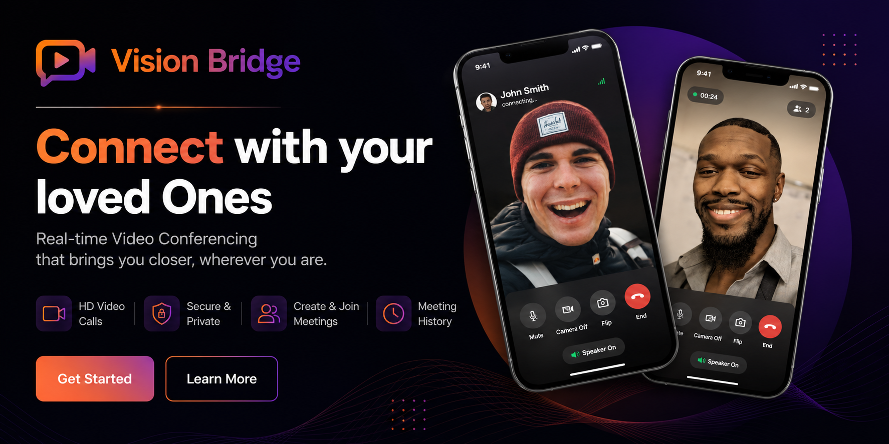
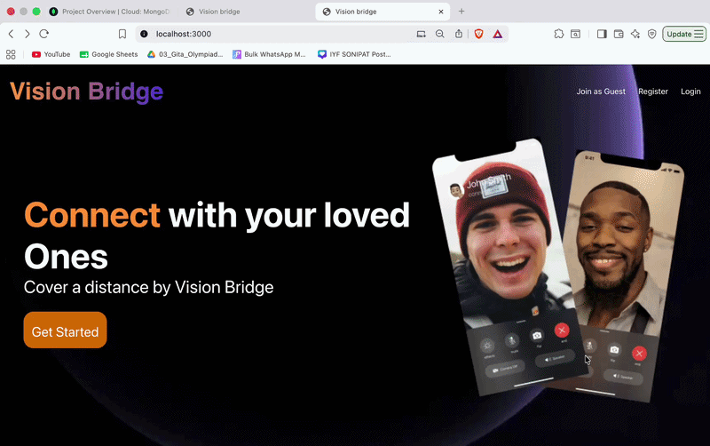
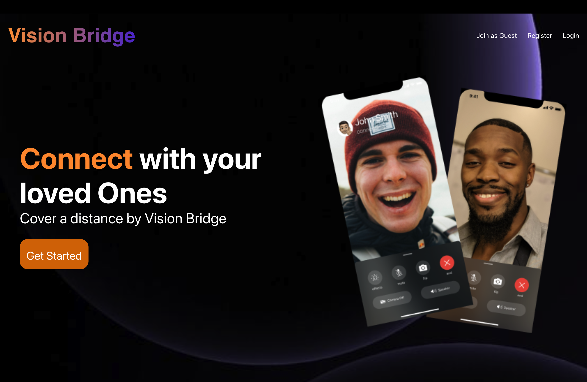
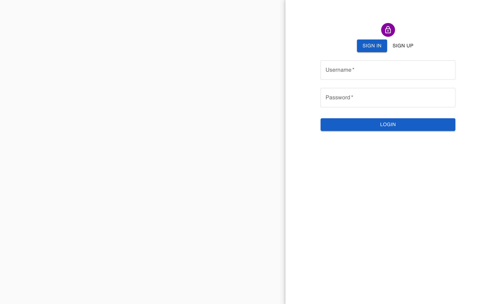
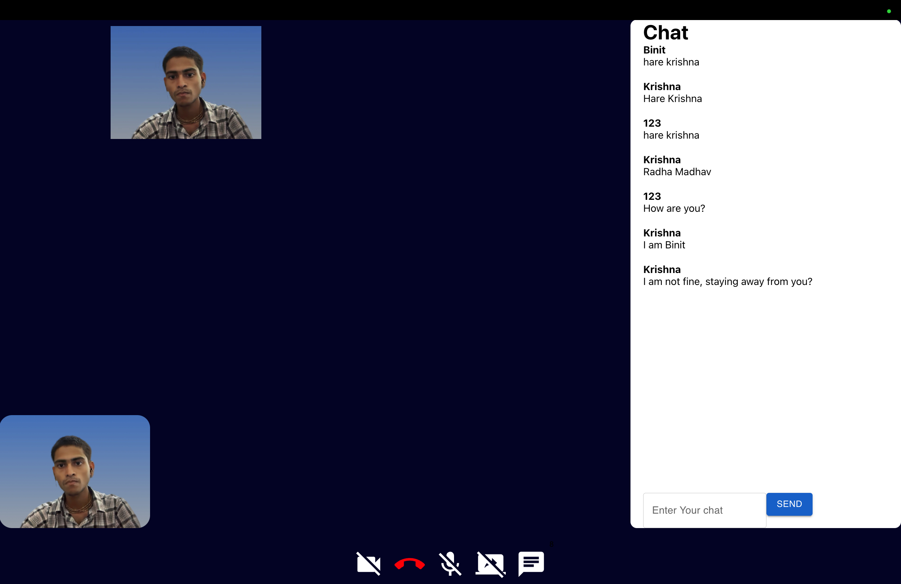
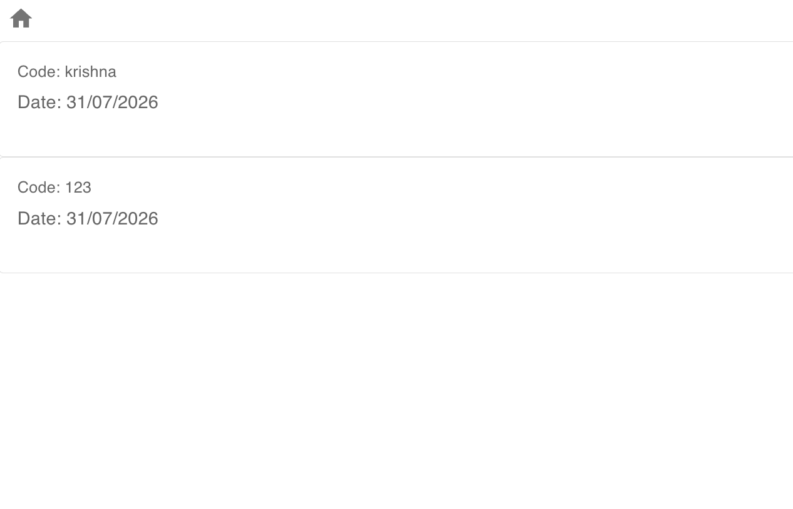

<p align="center">
  
</p>

<h1 align="center">🎥 Vision Bridge</h1>
<p align="center">
  <b>Real-Time Video Conferencing Platform built using MERN, WebRTC & Socket.io</b>
</p>

<p align="center">


</p>
## 🎬 Demo

<p align="center">
  
</p>

---

<h2 align="center">🚀 Live Demo</h2>

🔗 **Frontend:** https://vision-bridge-frontend.onrender.com/

📂 **GitHub Repository:** https://github.com/binitrajput/Vision-Bridge

---

# 📖 Overview

Vision Bridge is a full-stack real-time video conferencing platform that enables users to securely create and join meetings with high-quality audio and video communication.

The application uses **WebRTC** for peer-to-peer media streaming, **Socket.io** for signaling, and the **MERN stack** for user authentication, meeting management, and persistent storage.

---
## 📌 Key Highlights

- 🚀 Built a full-stack MERN application
- 🎥 Real-time video conferencing using WebRTC
- ⚡ Low-latency signaling with Socket.io
- 🔐 JWT Authentication & Bcrypt Password Hashing
- ☁️ MongoDB Atlas Cloud Database
- 📱 Responsive Material UI Design
# ✨ Features

- 🔐 Secure User Authentication
- 🎥 HD Video Calling
- 🎤 Real-Time Audio Communication
- 👥 Create & Join Meetings
- ⚡ WebRTC Peer-to-Peer Streaming
- 🔄 Socket.io Signaling Server
- 📜 Meeting History
- ☁️ MongoDB Atlas Integration 
- 🚀 Deployed on Render
- 🔒 Password Hashing using Bcrypt
- 📱 Responsive UI

---

# 🛠 Tech Stack

## Frontend

- React.js
- React Router DOM
- Material UI
- Axios
- CSS Modules

## Backend

- Node.js
- Express.js
- Socket.io
- JWT Authentication
- Bcrypt
- Mongoose

## Database

- MongoDB Atlas

## Real-Time Communication

- WebRTC
- Socket.io

## Deployment

- Render

---

# 🏗 System Architecture

```text
                   React Frontend
                          │
                Axios HTTP Requests
                          │
                  Express REST API
                          │
      ┌───────────────────┴───────────────────┐
      │                                       │
MongoDB Atlas                        Socket.io Server
                                              │
                                      WebRTC Signaling
                                              │
                                  Peer-to-Peer Connection
                                              │
                                    Video & Audio Stream
```

---

# 📂 Project Structure

```text
Vision-Bridge
│
├── backend
│   ├── src
│   │   ├── controllers
│   │   ├── managers
│   │   ├── middlewares
│   │   ├── models
│   │   ├── routes
│   │   └── app.js
│
├── frontend
│   ├── public
│   ├── src
│   │   ├── contexts
│   │   ├── pages
│   │   ├── styles
│   │   ├── utils
│   │   └── App.js
│
└── README.md
```

---


# ⚙️ Installation

## 1. Clone Repository

```bash
git clone https://github.com/binitrajput/Vision-Bridge.git
```

```bash
cd Vision-Bridge
```

---

## 2. Backend Setup

```bash
cd backend
npm install
```

Create a **.env**

```env
PORT=8000

MONGO_URI=YOUR_MONGODB_URI

JWT_SECRET=YOUR_SECRET_KEY
```

Run backend

```bash
npm run dev
```

---

## 3. Frontend Setup

Open another terminal

```bash
cd frontend
npm install
npm start
```

Application runs on

```text
Frontend → http://localhost:3000

Backend → http://localhost:8000
```

---

# 📸 Screenshots

## 🏠 Landing Page



---

## 🔐 Login / Register



---

## 🎥 Video Meeting



---

## 📜 Meeting History



---
# 🔮 Future Improvements

- 📺 Screen Sharing
- 💬 Chat Messaging
- 🎙 Meeting Recording
- 📂 File Sharing
- 📅 Meeting Scheduling
- 🌙 Dark Mode
- 📱 Better Mobile Experience

---

# 📚 What I Learned

- Developed a scalable MERN architecture
- Implemented peer-to-peer video communication using WebRTC
- Built real-time signaling with Socket.io
- Designed secure JWT-based authentication
- Integrated MongoDB Atlas for cloud data persistence
- Deployed a production-ready full-stack application on Render

---

# 👨‍💻 Author

### Binit Rajput

- GitHub: https://github.com/binitrajput
- LinkedIn: https://www.linkedin.com/in/binit-rajput-307a923b9

---

<p align="center">

⭐ If you found this project helpful, consider giving it a star!

</p>